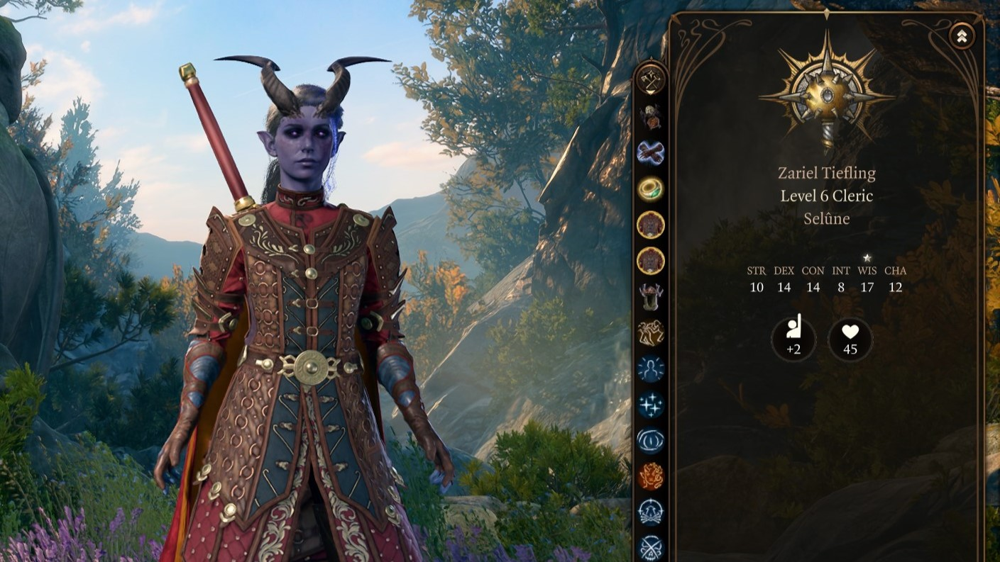
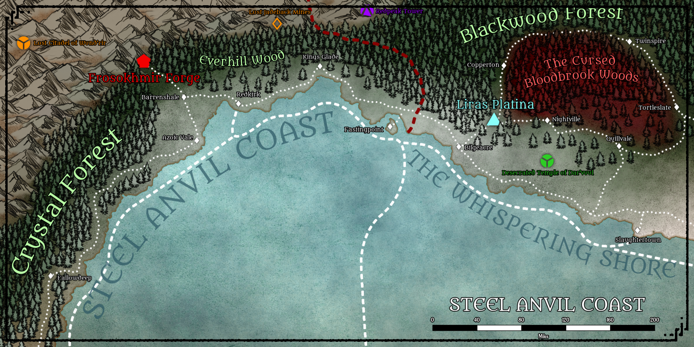
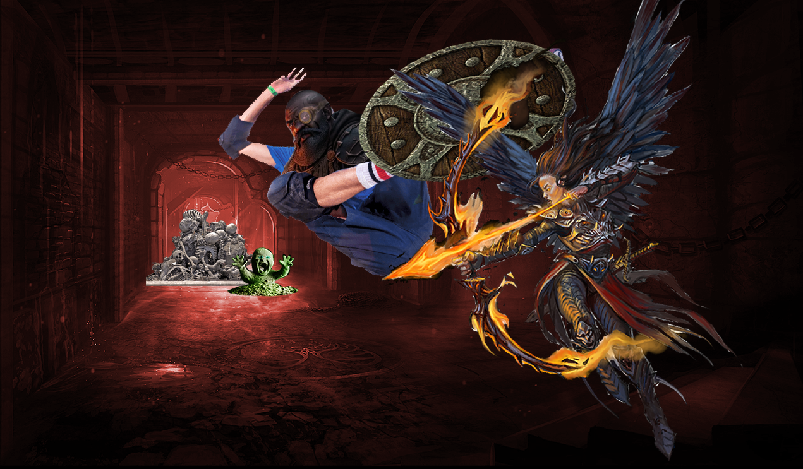
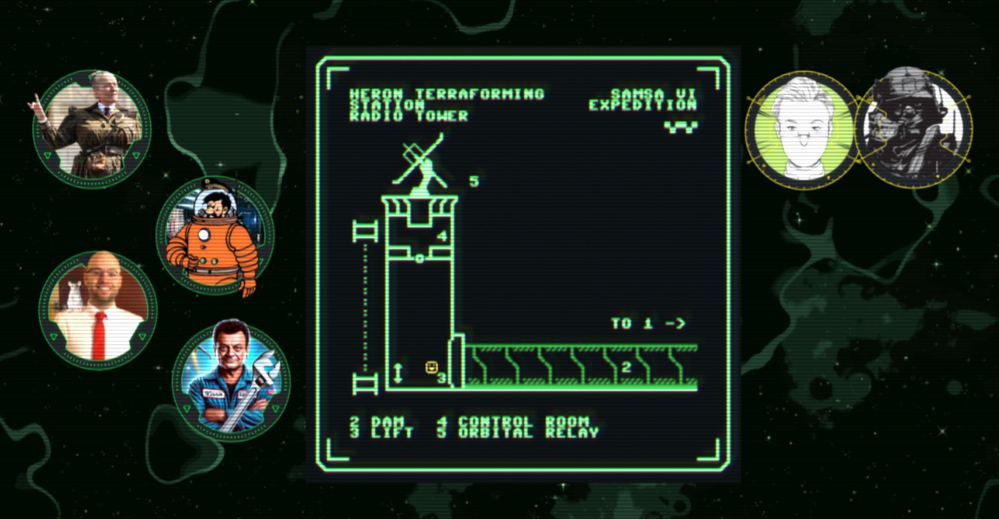

Hi all, it has been a while. A lot has happened in the years I did not write for my blog, like graduating and relationship things. I would like to write about the journey I went on playing roleplaying games and what I have personally learnt from them. See this as a journey throughout my experience with tabletop roleplaying games, but also as a vent piece. I just need to get things off my head. The post might feel aimless, and I am aware of this, this is more for me.

You might have been part of the games I am mentioning in this post, and I just want to say that I always enjoyed playing in your games and/or playing alongside you and that there are no bad feelings, this post is purely self-reflection.

*Before I start, I would like to thank a close and dear friend of mine who inspired me to make this post. They made a similar reflection post after their campaign that got me thinking about my own firsthand experiences.*

*You know who you are and thank you for all you have done for me recently.*

## Session 0: Expectations, or a Lack of

My first experiences with roleplaying games must have been in 2012-2013, when I was invited by a friend of mine back then to play in this game called Dungeons and Dragons. Back then I was a lot shyer and more inexperienced with talking to a bunch of people. It did not help that I was extremely young too in a group with two other people that probably were a decade older than me. We played as a group of 4 (3 players + 1 DM). My character back then was an elf cleric of Selûne, who for some reason became the face of the group in the first session we had together, which was not the right choice. I can hardly remember any of the other characters, other than a Tiefling rogue. 

You might think that this experience with roleplaying games is what started my love for this hobby, this was a **nightmare** for young me. I vividly remember our last session, where I was suddenly tasked by the DM with talking to this NPC. I could have mentioned to this NPC various things we saw on our way to the place, but for some reason I froze and did not know what to say. I was so embarrassed that I left the Skype call, pretending my internet went down, and never had a session with them again. The pressure was just too much for me.

Before I started becoming a DM and playing the game for real, I also took part in play-by-post game on Discord around 2015-2016. This is, what I feel, my first actual experience with the hobby. We played 5e, but very much in the background. We were basically roleplaying in a text chat, while the DM would roll things in private for when we made attacks or attempts for various things. We never saw any rolls, we just roleplayed. Whether this is really 5e or not, who is to say. There were two parts to this online game, one was where I played a goblin that joined in mid-campaign, and the other was where I played a sorcerer (I think?) that kind of went out of hand.

The goblin part of that game was fun, I vividly remember killing a giant spider and taking a tooth to use as a new knife, but other than that I cannot really remember that much about that mini campaign either. The other part of that game was less so, early on I once again was forced to become the face of the party, and I was presented with the illusion of a choice. I say ‘illusion’ because the DM was expecting me to take the *obvious* choice (to them). This did not sit well with me and the DM and the rest of the group, since I chose the more interesting choice for me. Eventually this group also fell apart after some arguments, and I did not play for a while after that.

*Thinking back, those first few sessions have not affected me in the present time as much, even if it is my first few experiences with the hobby. As a nod to this small part of my experience, I made my first character in Baldur’s Gate 3 a cleric to Selûne as well. The other two games are interesting to me, since it is actually the first time I had a negative experience with this hobby that stemmed from not setting expectations from the start. Something that will come up later in life as well.*

## Session 1: Inspiration

We arrive in December 2018, when I started my own campaign. I had been watching Critical Role for a little while and thought to myself: “Why not play this game with my high school friends?” What followed was a yearlong campaign which I will remember fondly as one of the most fun experiences I have ever had with friends. We called our group ‘Dungeons and Lads,’ and I tried to tell what I thought was an interesting fantasy story taking place in my first homebrew world.

Was the game I ran good? **Hell no.** I just started being a DM playing with 7+ players, the story was kind of dumb and overambitious, and our combats were extremely unbalanced at times. I also kept adding more homebrew features because they sounded cool. This just went on and on for months until they got TPK’ed, and that campaign ended after we all decided that would be best for us all. The most important part of this though?

***I had fun with my friends.***

After this extremely silly campaign, we ran another couple shorter campaigns, mostly ending due to multiple TPKs, until one of my players wanted to run a game for himself. After being a DM for two years I wanted to try out being a player again. I first played a water genasi druid that was searching for a dryad to thank them for backstory reasons. My idea was that this would become a nice emotional capstone somewhere down the road, little did I know that my entire backstory would be resolved within the first couple of sessions, leaving me with little to work with. There were other things that happened during this time, friction between the friend who was the DM in that campaign and me, us dealing with COVID era roleplaying, the abusive relationship I was in, and university stress kicking in hard. I made that character leave the party to then rejoin as a human fighter/samurai. After a while I stopped being in that campaign, since things got too much for me in general, and eventually distanced myself from that entire friend group for years. I have not spoken to most of them for four years now.

*I look back at this period with joy and shame, as this was probably the most fun I have had with friends in this hobby, but it is also the worst period of my personal life for a while. The quality of my games also became worse and worse as time went on. I started to become increasingly focused on the game and less on having fun with friends. A crucial mistake.*

## Session 2: Ego

Following this period comes December of 2020, I reconnected with a few people from that high school friend group and started a new set of campaigns for two years. I created new worlds, new ideas, and played some other tabletop roleplaying games like Blades in the Dark, Ten Candles, ~~and Maid RPG for a one-shot~~. These games filled in the hole left by me not participating in other games anymore. On one side they were fun, but my priority was not having fun with my friends, they were creating and playing a good game. I was focused on creating a world that would be interesting to interact with, for them to play in, but not really for them to have fun in. The obvious conclusion of this came when I personally stopped enjoying the hobby when there was a disconnect in our group I did not know how to deal with properly at the time. One player wanted to take in the world a little bit and do some stuff unrelated to the main quest at the time, and another player told them that that was a waste of time. This triggered something in me that recontextualized a lot of what I was doing and how I was running this campaign.

I started to really think about what my players were doing in my campaign and why. Was it because they wanted to, or was it because I wanted them to do it? Did they have *any* agency in the campaign at all? Were they having even having fun? ***Were they enjoying the game at all or were they just looking forward to the day we all got together to hang out?*** A lot happened in my mind and surrounding it, and I eventually concluded that the effort I put into the game was not being respected, as I thought some people did not seem to care about the game I was running at all.

*Looking back, this is just completely wrong. It was an egotistical conclusion. I should have talked to my group about it instead of slowly but surely drifting apart again. I am glad I still have some contact with some of you, but I wish we could have continued playing this hobby together, hopefully the right way. If any of you read this, I am sorry.*

## Session 3: Running and Playing Games

During the same period, I started a campaign with some of my online friends on Discord, which was an interesting campaign to say the least. I was dealing with a lot of personal stuff at the time, and juggling 2-3 campaigns at a time was not the brightest idea I had. The game was fun at parts, but it devolved into an “adventure of the week” style game that also did not prioritize the fun I was having with friends and instead was prioritizing the game again. It did not help when one of my players, in my attempt to run Wild Beyond the Witchlight for them, got really annoyed about levelling up and loot. That, plus the fact that people just stopped showing up for sessions just completely soured a lot of my enjoyment of the hobby as a whole. ~~Besides all that, I will never forget Sean, the flying monkey that died in our campaign.~~

I stopped playing tabletop roleplaying games for a while until I got invited to play in a game run by another online friend of mine. We played through Dragons of Stormwreck Isle, which is a really good adventure! The only thing that did not sit well with me personally was how, just like the other game I played in, my character and the story I wanted to tell with the group was taken from me and resolved before I could do anything, again leaving me with nothing. This is not the fault of the DM. The fault lies in the fact that we did not discuss these things in the open beforehand. Managing expectations is a huge part of this hobby, and I feel that when this does not happen, it leads to unwanted friction and conflict. It soured that game for me, and when I saw it happen to other people as well, it got worse. This is not a conscious thing the DM did, nor did they have any bad intention with this. It is purely a communcation error. It is something I keep thinking about when reflecting on the hobby. Overall, though, I really enjoyed the additions the DM made to the story and adventure. It is a shame their campaign fell apart after a long hiatus the way it did.

While my IRL game fell apart, I continued working on my world, and I still am. Worldbuilding is a big part of being a DM for me. It is an amazing creative outlet where I can do whatever I want. I am still learning and still figuring out what I want from my world, but now that I have the time and motivation to continue, I will try to post more on this blog as well about my journey at this time. I like writing in general, be it these blogposts, stories, or worldbuilding.

I had run a short campaign with another group of online friends that sort of fell apart multiple times, not because of any issues in the game, but because of circumstances outside of it. Two years in a row a close family member was hospitalized and the time surrounding that was incredibly stressful for me. This combined with a very sparse gaming schedule because of time zone differences within our group made it exceedingly difficult for me to focus on running the game for my friends. On one hand it felt bad because I genuinely enjoy running games for friends, but on the other hand we were all slowly becoming increasingly disconnected with the story we were all telling because we did not play that much. It drained my motivation to continue, and even to this day I still technically have one session to run for this campaign, but because of personal reasons I just cannot. I am sorry to those that enjoyed that campaign, I hope someday I can make up for it.

Being frustrated with a lot of extra work me and my DM friends had to put in to make 5e work the way we wanted it to; we tried out Pathfinder 2nd Edition. A quite different take on the tabletop roleplaying game, a take I am still not entirely sure I find myself agreeing with. Its focus on combat and tactical gameplay in my experience seems to slightly take away from other aspects of the roleplaying game. This might just be an isolated incident but it is something I have personally noticed outside of this game as well. We played the short introductory adventure to get an idea of how the system worked and then jumped into a yearlong campaign for Abomination Vaults, which was a bunch of fun most of the time. I started off playing an elf swashbuckler, who died, and then played a half-orc barbarian. Sidenote: Barbarians in Pathfinder 2nd edition are extremely fun. It feels good when your normal hits do as much damage as someone else’s' critical hit. Of course there is some friction with the structure of adventure, plus a relatively new DM, plus a new system, a lot of stuff that went *sort of* well, which lead to the overall experience maybe not being as we all expected and wanted. However, our DM did an excellent job running the adventure, it was a fun experience. Only thing I personally missed was a bit of roleplay inside of the game. Around halfway through there was a general shift in play dynamic where we were more focused on beating the adventure and maximizing our combat potential, and not telling a story together. This is partially a product of the structure of the adventure, since it is a megadungeon combatfest 99% of the time. Still fun, just in a different way.

I have now run 3 sessions of MOTHERSHIP's introductory adventure "Another Bug Hunt" and I must say that this campaign has been a lot of fun for me personally. I hope for my players as well. MOTHERSHIP is a very rules lite system that really focuses down on interaction between players and the world. There have been sessions where almost no dice had been rolled, we were just telling a story together. The sessions where we did roll a lot though did feel slightly different. It felt like we were playing a different game instead of playing the same game. This is a thing I have noticed throughout the years, and I do not exactly know how to put this into words yet, but there is some part of the game that feels like it is in opposition with the roleplaying side of a roleplaying game. I really want to explore this idea a bit further in a future post after I have done a bit more thinking. I still have one or two more sessions to run for this adventure as of me writing this post, and I am fully committed to finishing this campaign for sure. Hopefully after this campaign we can dive into 'Gradient Descent' which is a fantastic looking 'megadungeon' for MOTHERSHIP with an amazing atmosphere and core idea.

 

*This period for me is a bit of a weird one, since it is a time where I got to participate in other peoples' games and run campaigns with different people. It made me realize and internalize the fact that not everyone expects the same thing from tabletop roleplaying games. People play tabletop roleplaying games for distinct reasons, and that is fine. Playing MOTHERSHIP with that specific group also made me realize that once you do play with people that have similar expectations, the game can be elevated to a whole new level.*

## Session 4: Recall Knowledge

Now that I have summarized my entire tabletop roleplaying journey from start to finish, I want to spend some time reflecting on what happened and how I can improve my games and my life as well in the future.

- **Play.** There have been moments where I have thought to myself that I would not play tabletop roleplaying games anymore for a while. This mostly came due to bad experiences and life sometimes being very annoying and demotivating at times. Looking back throughout these 10+ years of play, I have realized that this hobby is important to me. Not just as a creative outlet, but for a way to have fun with friends. There have been times where this was not my main goal when participating in the hobby, and I genuinely regret those times. I have lost friends over this game, but also gained new ones.
- **Set expectations.** Have session zeroes, talk with the players, incorporate their ideas with your ideas. A major part of getting too obsessed with your own work is, well, protecting it like it is your own. A big realization I have had is that this is, at its core, a collaborative storytelling game. There really should not be any reason for the players' input to be besides your own work. Structuring my campaigns in such a way that the story is focused on the player characters and not just on the player group will bring a lot more engagement and enjoyment out of this game.
- **Play different systems.** Dungeons & Dragons 5th edition is cool and all but Pathfinder 2nd edition is an interesting and opinionated take on the game as well. MOTHERSHIP and its rules lite nature also bring a new view on the hobby. Blades in the Dark gives players a lot more agency in play, making the tabletop dynamic interesting and honestly very cool. ~~Maid RPG is just funny for one session.~~ Ten Candles also is a lot more collaborative with its storytelling, even more than Blades in the Dark. Playing different games also gives a broader view of not just the game but being a DM. Theres ideas that I can take from MOTHERSHIP that apply to any game I run. 
- **Keep groups small.** It is *so* much more comfortable running games that have only 3-4 players than 5+. With a smaller group it obviously makes scheduling easier, but it also makes it a more personal game. As a DM it makes it easier to spend more time on each player than having to thinly spread it over all players each session. If possible, I want to make every session as engaging as possible for as long as possible. This is not a very achievable goal at times, but let me tell you, having only three or four people to keep engaged is a lot easier than eight.
- **Take my time.** Sometimes I rush things. Rushing things leads to creating things that I am personally unhappy with, and having to work with those rushed things leads to general unhappiness when running games. I really must learn to take time to make my games as good as possible. Not that I should take weeks for a session, but things that should take a little bit of time, like maps or worldbuilding, should assume some more time. Let ideas grow over time than jotting down what is in my head right now.
- **Take it easy.** I do not have to make battlemaps for every occasion, theres enough to find online. I do not need special rules for anything homebrew or special occasions. All the homebrew things I added to my first games are all gone at the moment, they bloated the game up and it slowly lost the collaborative storytelling aspect by being buried under rules. As for battlemaps, they just take too much time. I have gotten to a point where I can comfortably spend a few hours and make a really good looking battlemap for a session, but it always takes me infinitely more time making the map, than making the majority of the content that is necessary in a session. All of this should give me more time and energy to focus on what is important, having fun with my friends.
- **Connect with my friends.** It is something I am working on over time. There is a lot of people I have drifted away from for no reason at all, and I should really not have. I am making slow steps in the right direction with my IRL friends, but even with my online friends I wish I could do more. This game is a game we play together. I am not just creating a story and letting people play in it.

## Session 5: One Year from Now

If you have read this post in its entirety, thank you for reading to my rambling. I am sure it is a little too aimless for your enjoyment, but it has helped me with internalizing some ideas I have had floating around in my head for a long while. I hope in a year I can look back at this post and see the personal growth I wanted to see from myself. I hope I am still participating in this hobby; I hope I am still writing, and I hope my friends still enjoy the time we spend together.

I want to run a new game, in the fantasy world I am still developing, and take in all the advice im giving to myself right now to heart in that campaign. I want to pour my heart and soul into this project, but then let it be shaped and detailed by the friends I am playing with. I really want a campaign to come to a conclusion, as none of my campaigns have ever really come to a satisfying conclusion yet. I want to experience the gratification of finishing a story, together. 

So, to you, Flore, one year from now:

***Have fun.***

