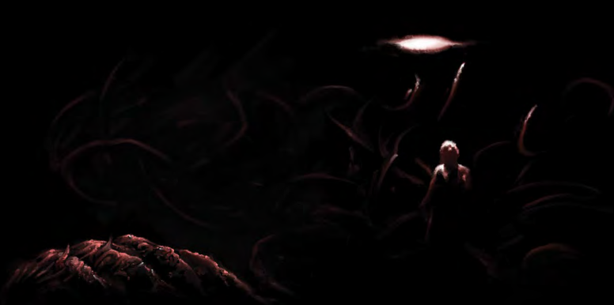
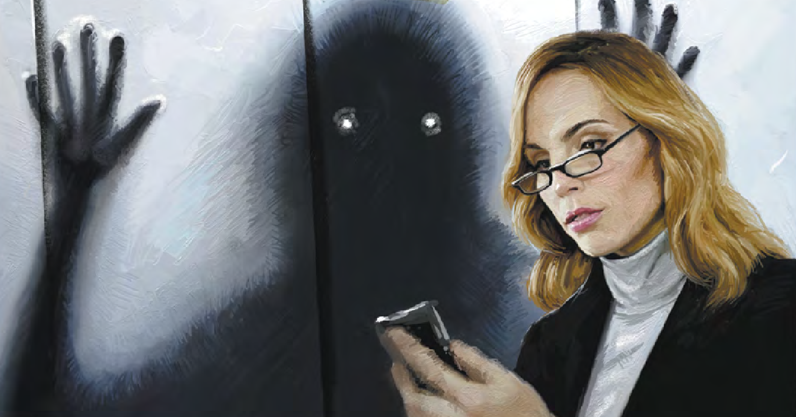
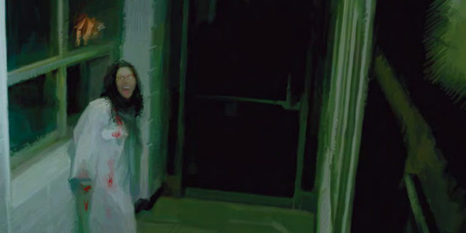
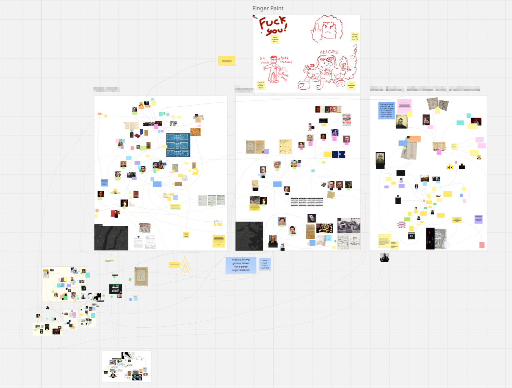

Ever since April 2025, when a friend first mentioned this TTRPG to me, I’ve slowly but surely been consumed by the Delta Green roleplaying game. It quickly became my de facto roleplaying game. After finishing my **Impossible Landscapes** campaign, preparing to start a new one called **Echo Chamber**, and writing my own short operation, **Slaughterhouse**, I felt compelled to spread the word about this fantastic system. So here I am.
<!--more-->

## How I got into Delta Green
I started off with Dungeons & Dragons 5th Edition and moved on to fantasy games like Pathfinder 2nd Edition, while also experimenting with titles such as Mothership and Blades in the Dark for a different vibe. Thinking back, I’ve always loved horror elements in roleplaying games, and I kept implementing them into the games I ran. I’ve never run Call of Cthulhu, though I did play in a short campaign... and I wasn’t much of a fan. It felt too pulpy for me, and the subject matter never felt particularly horrifying.

When my friend showed me Delta Green for the first time, a game that originally was a supplement for Call of Cthulhu, I didn't really think too much of it. We skimmed the free starter rulebook, **Need to Know**, and thought it was pretty cool. It wasn't until I watched [Quinns Quest](https://youtu.be/mx_yZHzfoHg)'s review of Delta Green and Impossible Landscapes that I really started to get into the game. 

I set out to gather a group of friends, run the introductory one-shot Last Things Last, play an operation in the middle, and then dive into the depths of Impossible Landscapes.

Now that I’ve finished the campaign as a Handler (Delta Green’s Game Master), I can’t overstate how much I’ve come to love this system, its themes, gameplay, ideas, and world.

## The Theme of Delta Green
> People come to Delta Green for many different reasons. They may like to weave a story, fashion a mystery, or devise some new horror. Whatever the reasons, in the end, that creation is never simple. When all the layers of the investigation are pulled back, more often than not, what is revealed is the stark nothingness of infinity.
>
>_Delta Green is about the end of humanity._
>
>You may make it seem to be about other things from time to time. About family. About life. About the things that make us human. It has all these things, but that’s not what it’s about.
>
>_It lies._
>
>_Delta Green is not about love._
>
>_Delta Green is not about safety._
>
>_Delta Green is not about reason._
>
>_Delta Green is about humanity’s true place in the universe._
>
>And that place is nowhere.

This quote, taken from Delta Green's official [About page](https://www.delta-green.com/about/) expertly sets the tone for the game. It's dark, it's depressing, it's bleak, but the characters keep on fighting for their own personal motivations.

In contrast to Call of Cthulhu's setting of the Roaring 20s where you play as old-timey investigators, Delta Green takes modern-day government workers brought into the covert group whose mission is to investigate, contain, and conceal unnatural incursions and asks very tough choices from them. How do you deal with the unnatural, while also keeping it a secret from everyone? How do you convince local law enforcement that nothing out of the ordinary is going on? On who do you pin the deaths the monster has caused? It's less 'this is a scary thing' horror and more 'how can I live with myself?' horror. 

You're playing as a regular guy, an FBI Agent, a CDC analyst, a local cop, having to deal with horrors beyond understanding, barely surviving them, and having their relationship with their family get ruined by the consequences of their actions as a reward.

Great stuff.

What I love about Delta Green is that not only is the tone, setting, and theme something I personally really like, the actual mechanics and gameplay support this same tone.

## Playing Delta Green
Delta Green uses the familiar d100 system from Call of Cthulhu. Agents have six core attributes, Strength, Dexterity, Constitution, Intelligence, Power, and Charisma, and around forty skills. Character creation is very flexible, you can make any investigator, scientist, pathologist, historian, computer scientist, anything really that you want to play as. Agents also track Hit Points (HP), often perilously low; Willpower Points (WP), which drain as quickly as you’re willing to spend them; and Sanity Points (SAN), which will eventually be an Agent’s undoing, assuming they aren’t physically destroyed first.

The way skills work in Delta Green is simple and straightforward, you roll under the percentage in that skill, and you succeed. Interestingly, when circumstances are calm and controlled, you often don’t roll dice at all. The Handler decides based on how high your skill rating is if you succeed or not, or how long something takes. This removes some of the infuriating randomness that can derail mystery-style scenarios and reinforces that Agents are competent experts.

In general, the Agent's Handbook gives enough simulation through tables and rules to play the game and make meaningful and interesting choices, while staying simple enough such that the Handler doesn't have to constantly refer back to the book to know what to do.

Where Delta Green really shines is when it comes to Bonds. Every Agent has 2-4 Bonds. They measure the relationship between your Agent and the vital people in their life. This can be loved ones, family members, close friends, etc. Bonds are a crucial part of your Agent's story during play. The unique thing that Delta Green does that I personally really love is that when you lose SAN, you can choose to divert some of that onto a bond, reducing the amount of SAN you lose in the moment. The next time your Agent interacts with that Bond, you decide how this loss in that Bond manifests. Does the Agent get angry? Do they become too reliant on the bond? Do they abandon them for other people? 
For example, your Agent returns home and lashes out at their spouse for asking where they’ve been. It adds drama purely through mechanics, a roleplay edge woven directly into the rules, something I rarely see in other TTRPGs.

## The Delta Green Books
I currently own the **Agent’s Handbook**, **Handler’s Guide**, **Impossible Landscapes**, **God’s Teeth**, **God’s Hunt**, and **The Conspiracy** in physical form, with **A Night at the Opera**, **Black Sites**, and **Dead Drops** hopefully arriving soon. I own all the books in PDF form, but I really wanted to have the physical books as well. The **Agent's Handbook** does a great job of setting the tone and explaining the rules, **Impossible Landscapes** is a fantastic module which I will review at a later date, and the other books are all filled with either great background information and lore of Delta Green, or well-written operations to either string together into a campaign, or run separately. I keep coming back to **The Conspiracy** and the **Handler's Guide** to harvest ideas or get a better sense of the unnatural world of Delta Green.

A slight tangent on the Quinns Quest review that I want to get off my chest: I don't have an issue with saying that you can skip the **Handler's Guide**, since it isn't necessary to run the game. I do have an issue with the weird disdain the review had for the book. I wish the review was a little more nuanced with not recommending the **Handler's Guide** instead of just kinda... shitting on it? I feel the main takeaway from Quinn's thoughts on the **Handler's Guide** is less "you don't need to have the book to run your games," which is a valid take, and more "the book is nerd shit (derogatory), its not worth getting it." 

Anyhow, tangent over.

## What do my players think of Delta Green?
I asked my players if they wanted to add something to the article themselves about their experiences with Delta Green and our Impossible Landscapes campaign. 

One player sent me a long reflection, and I want to include it in full because it meant a lot to me:
>Today, unprompted by Flore and mostly reminiscing about the campaign and enjoying the attention of me making our friend Matin cry after her helplessness to save my character, I was thinking that Delta Green, in my opinion, probably got us to bond more together—which is very ironic about it considering the self-destruction of your character’s bonds with others!
>
>I mentioned it on a bsky post to Detwiller (co-creator of Delta Green and author of Impossible Landscapes (IL)) that I was eyeing up Delta Green for years but never made a jump. Flore had dived in on my behalf, and I followed into a strange labyrinth of surreal horror that IL sets up (coincidentally my favourite type of horror!). I absolutely adored the experience, it was a blast, and I am so proud of Flore being able to run it smoothly from start to finish after being a witness to his Dungeons & Dragons campaigns and the lack of motivated people at the table who aren’t him or myself. It was really inspiring.
>
>Flore has asked me to say what I like and do not like about Delta Green, and I can wholeheartedly say I like everything—especially the post-modern setting inspired by conspiracy theories (1990s Delta Green is like Deus Ex (2000))! I see only pros and no personal cons with Delta Green as a system. This might change with more time in the system, and seeing a con in future is not even a true negative as it might inspire me to create something as I believe I should never judge if I cannot create a solution to resolve my personal problem. I want to play more Delta Green! The cosmic horror side of this is exciting, and I will be open-minded even if surreal horror is my favourite subgenre.
>
>I just finished running BLACKSAT from Control Group in my own group and despite reading the adventure twice before running I felt like I was stumbling following a pre-written adventure which is not my usual forte. HUGE respect for Flore.
>
>To close, the too long; did not read is I love my friends and Flore put his heart and soul into this, and I hope he can see how much we appreciated his effort.

Another one of my players said this:
> Big fan of the bonds/sanity system because it allows for organic storytelling and makes a gameplay aspect a story aspect as well (if you have no-one any more you go nuts more easily, makes sense). I think one thing I disliked isn't really a problem with the system but more with my mindset going in, the dnd-type mindset where you're trying to look at inventory and stats and trying to use all that because it's there - you generally don't need to.
>
>THAT SAID I do think there's WAY too many skills and they could be a bit more generalized, like even if points are kind of fake it does feel bad to make your character great at heavy machinery which then just straight up doesn't come up. It feels like an artifact of an older, more classic ttrpg. The most fun ones are the bonus art/language ones, there should be more of that (like weird specializations that only come up once but are relevant in the moment).

## What's next for me?
As I mentioned in the introduction, I’m currently outlining a new campaign for my friends called **Echo Chamber**, which draws operations from **A Night at the Opera**, **Black Sites**, **Dead Drops**, and **The Labyrinth**, weaving them into a single overarching narrative.

I am also writing a short scenario I hope to submit to the 2025 Delta Green Shotgun Scenario Contest called **Slaughterhouse** based on some of the horror stuff that I like. 

Besides those two things, I want to write a comprehensive review on **Impossible Landscapes** as a module next. I really liked that module and I want to share my thoughts on it as well. I also want to write some short articles with tips and tricks on running **Impossible Landscapes**, just to help out any new Handlers that want to know what they're getting into.

If anything, I’ll be playing a lot more Delta Green.